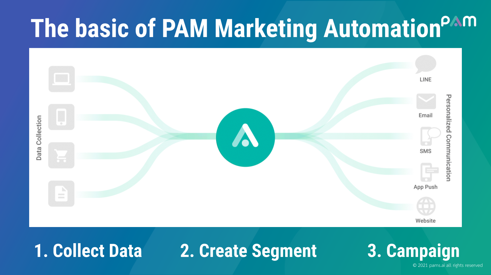
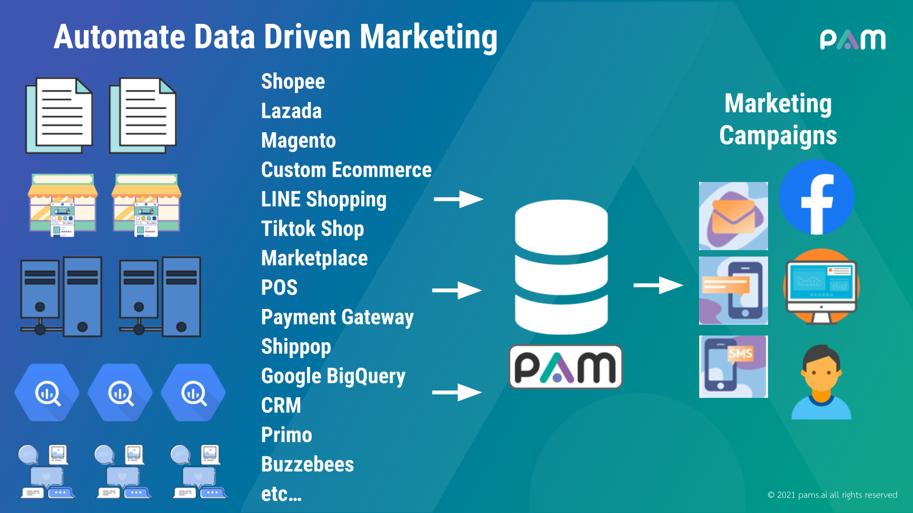

[back](./)

## PAM Marketing Automation

PAM can help marketer do their everyday tasks easier & automate. To increase operational efficiency and grow revenue faster. PAM will collect & analyze customer data, and send the ‘right message’ to the right channel at the ‘right timing’ to engage with customers.

### Presentations

<table>
  <tr>
    <td></td>
    <td></td>
    <td></td>
    <td></td>
  </tr>
</table>
