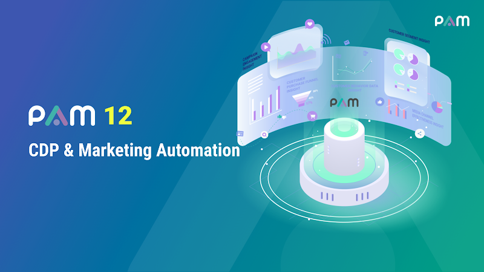
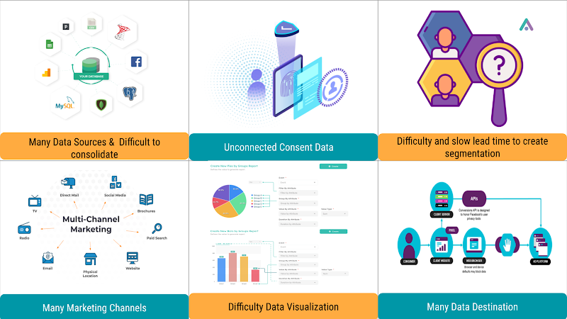
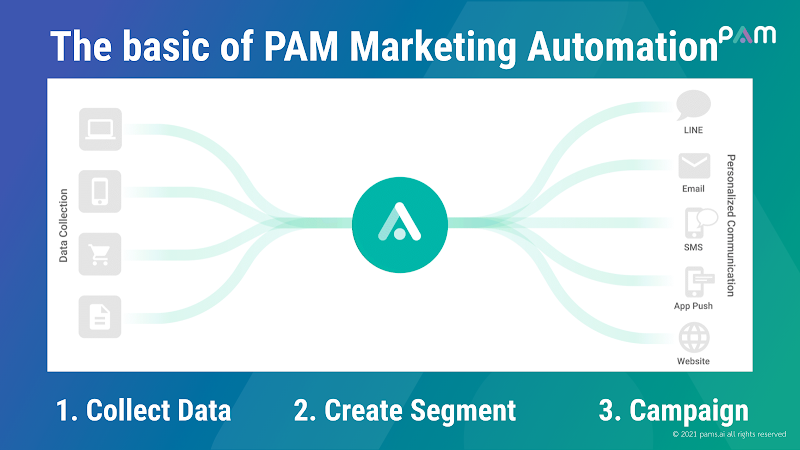
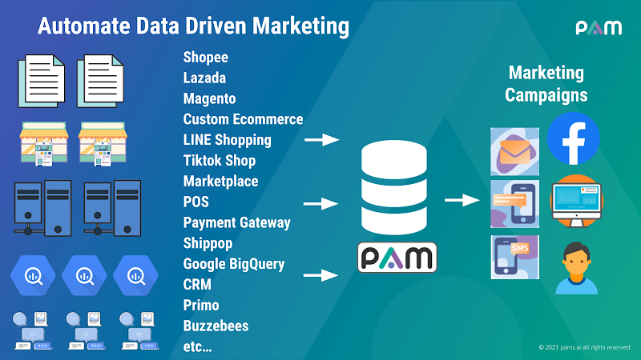
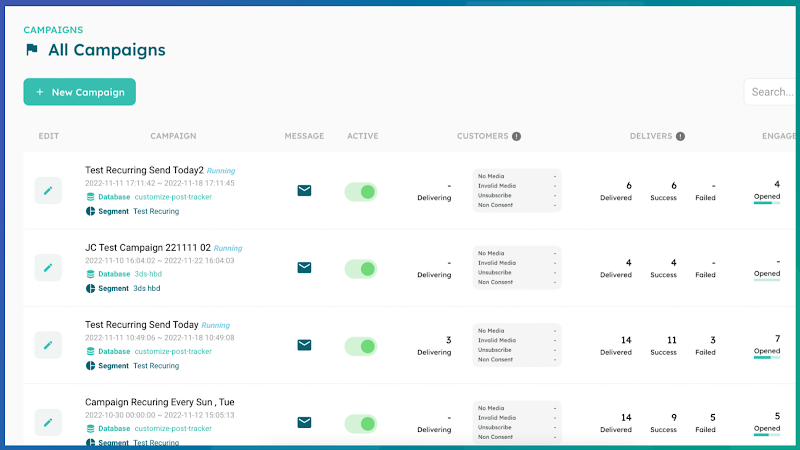
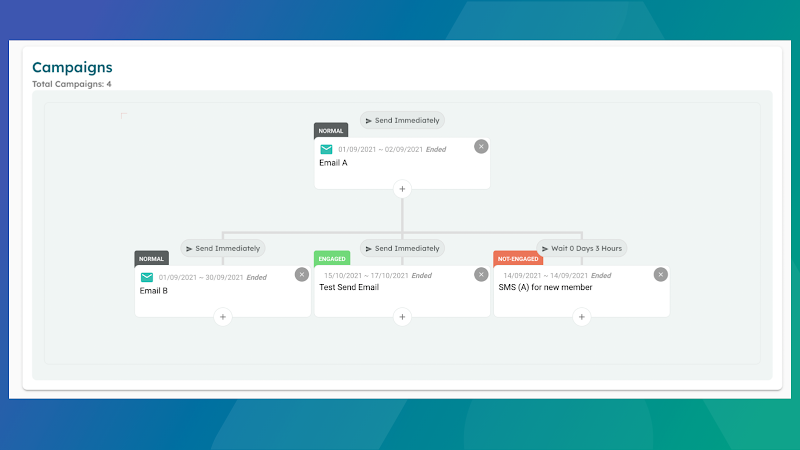

[back](./)

## PAM

> CRM, CDP, Marketing Automation

PAM can help marketer do their everyday tasks easier & automate. To increase operational efficiency and grow revenue faster. PAM will collect & analyze customer data, and send the ‘right message’ to the right channel at the ‘right timing’ to engage with customers.

### Contacts

| Channels        | Contact |
|:----------------|:------------------------------------|
| Website |[https://pams.ai](https://pams.ai)|
| Email |chananya@pams.ai|
| Mobile |+66909832659|
| Facebook |[https://www.facebook.com/PAMmarketingAutomation](https://www.facebook.com/PAMmarketingAutomation)|

### Presentations

<table>
<tr>
<td></td></tr>
<tr>
<td></td></tr>
<tr>
<td></td></tr>
<tr>
<td></td></tr>
</table>

### Screenshots

<table>
<tr>
<td></td></tr>
<tr>
<td></td></tr>
<tr>
<td></td></tr>
<tr>
<td></td></tr>
</table>
